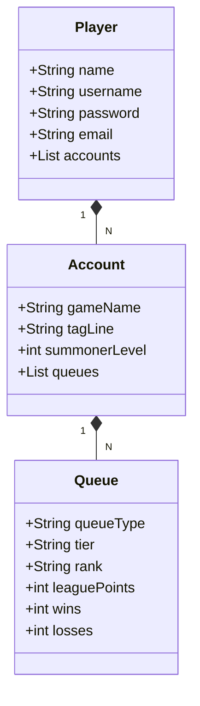

<h1 align="center" style="font-weight: bold;">League API</h1>

<p align="center">
 <a href="#tech">Technologies</a> • 
 <a href="#started">Getting Started</a> • 
  <a href="#routes">API Endpoints</a> •
 <a href="#colab">Collaborators</a> •
 <a href="#contribute">Contribute</a>
</p>

<p align="center">
    <b>Projeto que se conecta com algumas APIs da Riot Games e retornam dados do jogador informado..</b>
</p>

<h2 id="technologies">💻 Technologies</h2>

- Java
- SpringBoot

<h2 id="started">🚀 Getting started</h2>

<h3>Prerequisites</h3>

- [Java JDK 17]([https://github.com/](https://www.oracle.com/java/technologies/javase/jdk17-archive-downloads.html))
- IDE da preferência (IntelliJ, VSCode, Eclipse, etc)

<h3>Cloning</h3>

```bash
git clone (https://github.com/henrique0120/league-api)
```
<h3>Starting</h3>

```bash
mvnw.cmd clean install
mvnw.cmd spring-boot:run
```

<h2 id="routes">📍 API Endpoints</h2>

| route               | description                                          
|----------------------|-----------------------------------------------------
| <kbd>GET /summoner</kbd>     |  recupera as informações com base nos dados da conta informada.

<h3 id="get-auth-detail">GET /authenticate</h3>

<p>A consulta é realizada informando pares de chave valor:- gameName - tagLine - region de contas do League Of Legends.</p>

**RESPONSE**
```json
[
    {
        "gameName": "xxxxx",
        "tagLine": "br1",
        "summonerLevel": 396,
        "queueType": "RANKED_FLEX_SR",
        "tier": "DIAMOND",
        "rank": "I",
        "leaguePoints": 75,
        "wins": 38,
        "losses": 6
    },
    {
        "gameName": "xxxxx",
        "tagLine": "xxxxxx",
        "summonerLevel": 396,
        "queueType": "RANKED_SOLO_5x5",
        "tier": "CHALLENGER",
        "rank": "I",
        "leaguePoints": 642,
        "wins": 116,
        "losses": 90
    }
]
```


## Diagrama de Classes


