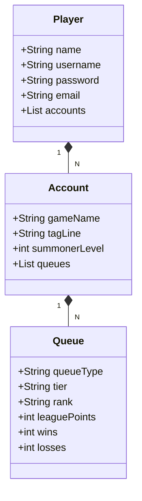

Projeto que se conecta com algumas APIs da Riot Games e retornam dados do jogador informado.

## Diagrama de Classes

```mermaid
classDiagram
    class Player {
        +String name
        +String username
        +String password
        +String email
        +List<Account> accounts
    }

    class Account {
        +String gameName
        +String tagLine
        +int summonerLevel
        +List<Queue> queues
    }

    class Queue {
        +String queueType
        +String tier
        +String rank
        +int leaguePoints
        +int wins
        +int losses
    }

    Player "1" *-- "N" Account
    Account "1" *-- "N" Queue
```
