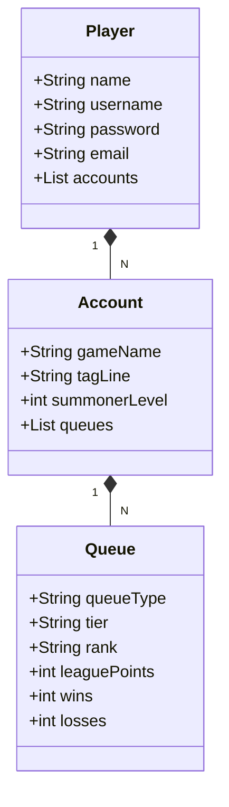

<h1 align="center" style="font-weight: bold;">League API</h1>

 <a href="#tech">Technologies</a> • 
 <a href="#started">Getting Started</a> • 
  <a href="#routes">API Endpoints</a> •
  •
 <a href="#contribute">Contribute</a>

    <b>Projeto que se conecta com algumas APIs da Riot Games e retornam dados do jogador informado..</b>

<h2 id="technologies">💻 Technologies</h2>

- Java
- SpringBoot

<h2 id="started">🚀 Getting started</h2>

<h3>Prerequisites</h3>

Here you list all prerequisites necessary for running your project. For example:

- [Java JDK 17]([https://github.com/](https://www.oracle.com/java/technologies/javase/jdk17-archive-downloads.html))
- [Git 2](https://github.com)
  
## Diagrama de Classes

